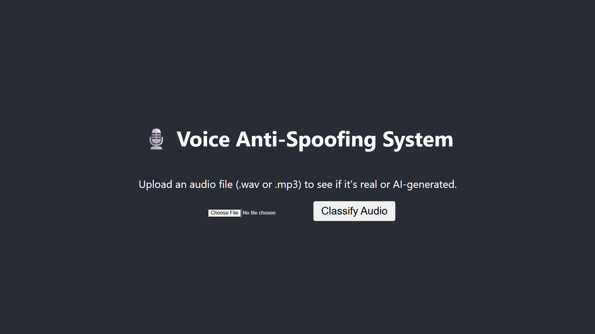

# Voice Anti-Spoofing System 🎙️

[](https://www.python.org/) [](https://pytorch.org/) [](https://fastapi.tiangolo.com/) [](https://reactjs.org/)

This repository contains a complete deep learning project for detecting AI-generated (spoofed) voices. The system is built on a robust workflow that includes data preprocessing, comparative model training, advanced fine-tuning, and deployment into interactive full-stack web applications.

The core of the project is a comparative study between multiple deep learning architectures to determine the most effective approach for audio anti-spoofing.

<!-- It's highly recommended to add a screenshot of your running web app here! -->


---

## Features

-   **Comparative Model Analysis:** Systematically trains and evaluates three distinct deep learning architectures:
    1.  **Baseline CNN:** A simple convolutional neural network to establish a performance baseline.
    2.  **Deeper CNN:** An enhanced CNN with more layers and batch normalization for improved stability.
    3.  **Vision Transformer (ViT):** A state-of-the-art, pre-trained model fine-tuned for spectrogram analysis.
-   **Efficient Two-Stage Training:** Implements a robust workflow to first train models from scratch on a large dataset and then fine-tune them with data augmentation to combat overfitting and improve generalization.
-   **Interactive Web Applications:** Deploys the trained models using two separate full-stack applications, allowing users to upload audio files and receive real-time predictions.
-   **High-Performance Backend:** Built with **FastAPI** for an asynchronous, fast, and reliable API.
-   **Modern Frontend:** A responsive and user-friendly interface built with **React.js**.

---

## Project Workflow & Notebooks

The project's development is documented across four Jupyter notebooks, each serving a specific purpose in the workflow.

1.  **`FakeVsReal_1.ipynb`**: The initial exploratory notebook. This was used for early-stage development, prototyping the basic data loading pipeline, and training a simple CNN on a smaller subset of the data (`for-rerec` dataset) to ensure the core concepts were viable.

2.  **`SamplingDataset.ipynb`**: A utility notebook created to solve a practical problem. Its purpose is to create a smaller, representative subset of the massive `for-original` dataset. This allows for rapid prototyping and debugging of models without waiting hours for training on the full dataset.

3.  **`FakeVsReal_2.ipynb`**: The main initial training script. This notebook scales up the process by training all three models (Baseline CNN, Deeper CNN, ViT) from scratch on the full, large `for-original` dataset. The trained models from this stage are saved (`..._model.pth`) for the next step.

4.  **`FakeVsReal_2_FineTunning.ipynb`**: The final and most important stage. This notebook loads the initially trained models and fine-tunes them for a few more epochs using advanced techniques like data augmentation and a lower learning rate. This step is crucial for combating overfitting and significantly improving the models' final performance. The final, production-ready models (`..._finetuned.pth`) are saved from this notebook.

---

## Model Performance

The final test accuracies for the fine-tuned models on the unseen test set are as follows:

| Model                     | Test Accuracy |
| ------------------------- | :-----------: |
| Fine-Tuned Baseline CNN   |    **99.51%** |
| Fine-Tuned Deeper CNN     |    **99.63%** |
| Fine-Tuned ViT            |    **99.75%** |

---

## Setup and Installation

Follow these steps to set up the project and run the applications locally.

### 1. Clone the Repository

```bash
git clone [https://github.com/Laabh-Gupta/Fake_Vs_Real_Voice_Detection.git](https://github.com/Laabh-Gupta/Fake_Vs_Real_Voice_Detection.git)
cd Fake_Vs_Real_Voice_Detection
```

### 2. Download the Dataset

This project uses "The Fake or Real Dataset" from Kaggle.

-   **Download Link:** [https://www.kaggle.com/datasets/mohammedabdeldayem/the-fake-or-real-dataset](https://www.kaggle.com/datasets/mohammedabdeldayem/the-fake-or-real-dataset)
-   Download the `for-original.zip` file.
-   Unzip it and place the resulting `FakeVsRealDataset(for-original)` folder inside the root of your cloned project directory.

### 3. Set Up the Python Backend Environment

This project uses Conda to manage backend dependencies.

**A. Create the Conda Environment:**
This command creates a new environment named `fastapi_env` with all the necessary libraries.

```bash
conda create -n fastapi_env python=3.10
conda activate fastapi_env
```

**B. Install Dependencies:**
Install all required Python packages into your new environment.

```bash
pip install "fastapi[all]" uvicorn torch torchaudio torchvision python-multipart SoundFile
```
*Note: If you have a CUDA-enabled GPU, you may want to install a specific PyTorch version that supports it. Visit the [PyTorch website](https://pytorch.org/get-started/locally/) for the correct command.*

### 4. Set Up the React Frontend Environment

The frontend requires Node.js and npm.

**A. Navigate to a Frontend Directory:**
Choose one of the frontend applications to set up first.

```bash
# Example for the Baseline CNN frontend
cd "Baseline Web App/audio_classifier_app_baseline"
```

**B. Install Dependencies:**
This command installs all the necessary React packages.

```bash
npm install
```
*Repeat this step for the `"ViT Web App/audio-classifier-frontend"` directory as well.*

---

## Running the Web Applications

To run an application, you must start both its backend and frontend servers simultaneously in two separate terminals.

### Example: Running the Baseline CNN Application

#### Terminal 1: Start the Backend Server

1.  Activate the Conda environment:
    ```bash
    conda activate fastapi_env
    ```
2.  Navigate to the backend directory:
    ```bash
    cd "Baseline Web App/audio_app_baseline"
    ```
3.  Start the Uvicorn server:
    ```bash
    uvicorn main:app --reload
    ```
    Your AI backend is now running at `http://127.0.0.1:8000`.

#### Terminal 2: Start the Frontend Server

1.  Navigate to the frontend directory:
    ```bash
    cd "Baseline Web App/audio_classifier_app_baseline"
    ```
2.  Start the React development server:
    ```bash
    npm start
    ```
    Your browser will automatically open to `http://localhost:3000`, where you can use the application.

***Note on Model Choice:*** *While both applications are fully functional, the **Baseline Model Application** is recommended as it is the most accurate model practically.*

---

## License

This project is licensed under the MIT License. See the `LICENCE` file for details.